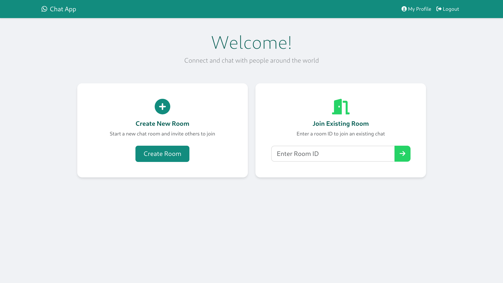
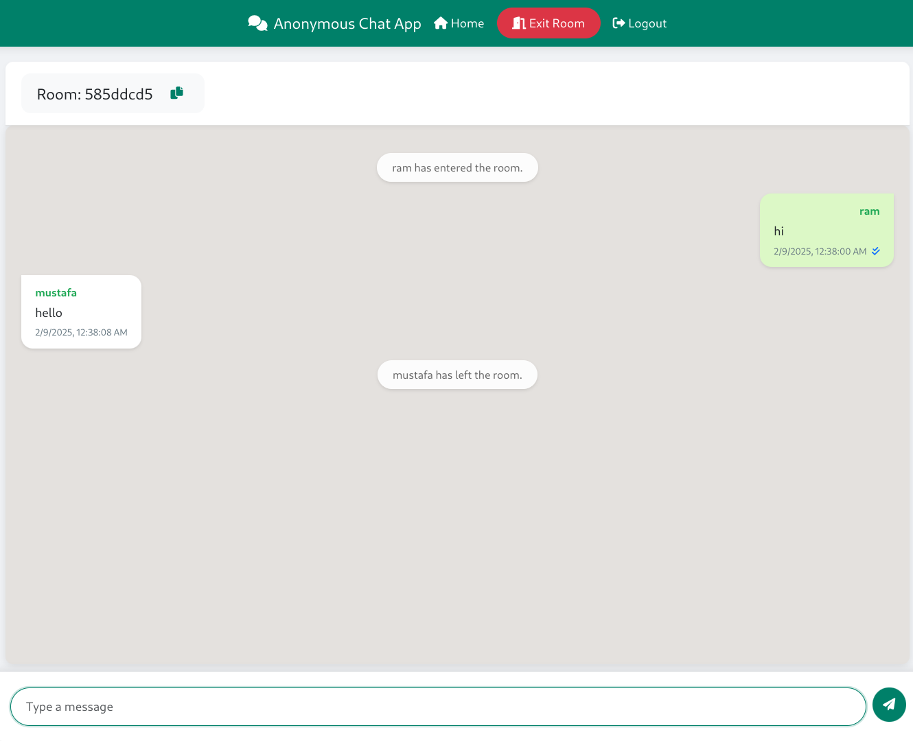

# Real-Time Chat Application with Spring Boot and React

This project is a full-stack real-time chat application built using Spring Boot for the backend and React for the frontend. It enables users to join chat rooms, send messages, and receive real-time updates through WebSocket communication.

🔗 **Live Demo**: [https://realchatapplicaton.onrender.com/](https://realchatapplicaton.onrender.com/)

  
  

## Features

- Real-time messaging using WebSocket/STOMP
- User authentication and authorization
- Persistent chat history using PostgreSQL
- User join/leave notifications
- Unique avatar colors for each user
- Responsive design for all devices
- Dockerized deployment
- Cross-origin resource sharing (CORS) support

## Technology Stack

### Backend
- Spring Boot 3.x
- Spring Security with JWT authentication
- Spring WebSocket + STOMP
- Spring Data JPA
- PostgreSQL database
- Maven build tool

### Frontend  
- React 18
- Vite build tool
- SockJS client
- STOMP websocket client
- Tailwind CSS

## Project Structure

### Frontend (`chat-app-client/`)