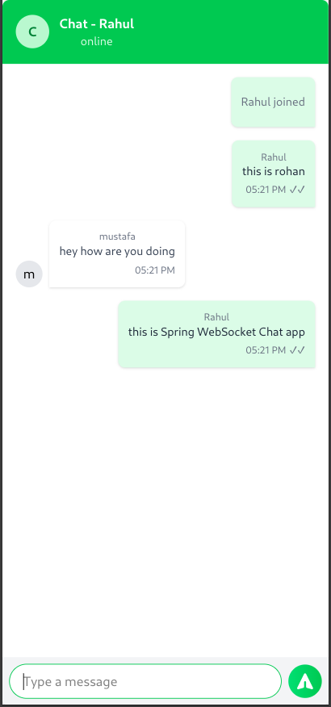
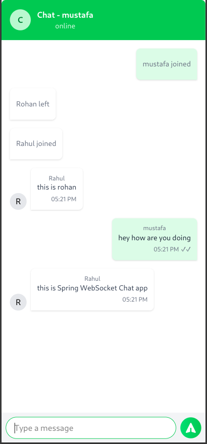

# Real-Time Chat Application with Spring Boot and React

This project is a full-stack real-time chat application built using Spring Boot for the backend and React for the frontend. It enables users to join chat rooms, send messages, and receive real-time updates through WebSocket communication.
# Real-Time Chat Application with Spring Boot and React

This project is a full-stack real-time chat application built using Spring Boot for the backend and React for the frontend. It enables users to join chat rooms, send messages, and receive real-time updates through WebSocket communication.

🔗 **Live Demo**: [https://realchatapplicaton.onrender.com/](https://realchatapplicaton.onrender.com/)


<div align="center">
  
  
</div>


The application consists of two main components: a Spring Boot server that handles WebSocket connections and message routing, and a React client that provides a user interface for chatting. The server uses STOMP (Simple Text Oriented Messaging Protocol) over WebSocket for efficient, bidirectional communication between clients and the server.

Key features of this chat application include:
- Real-time messaging using WebSocket
- User join and leave notifications
- Unique avatar colors for each user
- Responsive design for various screen sizes
- Dockerized Spring Boot server for easy deployment

## Repository Structure

The repository is organized into two main directories:

### chat-app-client
- `src/`: Contains the React application source code
  - `App.jsx`: Main React component
  - `component/WebSocketChat.jsx`: WebSocket chat component
  - `config.js`: Configuration file for the client
- `package.json`: Node.js dependencies and scripts
- `vite.config.js`: Vite build tool configuration

### chat-application-server
- `src/main/java/com/chat/chat/application/`: Java source code
  - `ChatApplication.java`: Spring Boot application entry point
  - `config/`: Configuration classes for WebSocket and Jackson
  - `controller/`: WebSocket event handlers and controllers
  - `model/`: Data models like ChatMessage
- `src/main/resources/`: Application properties and static resources
- `pom.xml`: Maven project configuration
- `Dockerfile`: Docker configuration for the server

## Usage Instructions

### Prerequisites
- Java Development Kit (JDK) 17
- Node.js 14+ and npm
- Maven 3.6+
- Docker (optional, for containerization)

### Server Setup

1. Navigate to the `chat-application-server` directory:
   ```
   cd chat-application-server
   ```

2. Build the Spring Boot application:
   ```
   mvn clean package
   ```

3. Run the server:
   ```
   java -jar target/chat-application-0.0.1-SNAPSHOT.jar
   ```

   The server will start on `http://localhost:8080`.

### Client Setup

1. Navigate to the `chat-app-client` directory:
   ```
   cd chat-app-client
   ```

2. Install dependencies:
   ```
   npm install
   ```

3. Start the development server:
   ```
   npm run dev
   ```

   The client will be available at `http://localhost:5173`.

### Docker Deployment (Optional)

To run the server in a Docker container:

1. Build the Docker image:
   ```
   docker build -t chat-application .
   ```

2. Run the container:
   ```
   docker run -p 8080:8080 chat-application
   ```

### Using the Chat Application

1. Open the client application in your web browser.
2. Enter a username on the login page.
3. Start chatting in the public chat room.

### Troubleshooting

- If you encounter connection issues, ensure that the server is running and accessible.
- For WebSocket connection problems, check your browser's console for error messages.
- If messages are not being received, verify that you're subscribed to the correct topic (`/topic/public`).

## Data Flow

The chat application follows this data flow:

1. Client connects to the WebSocket server at `/ws` endpoint.
2. Server accepts the connection and establishes a WebSocket session.
3. Client sends a JOIN message to `/app/chat.addUser` when a user enters the chat.
4. Server broadcasts the JOIN message to all connected clients via `/topic/public`.
5. When a client sends a chat message, it's sent to `/app/chat.sendMessage`.
6. The server processes the message and broadcasts it to all clients via `/topic/public`.
7. Clients receive messages and update their UI accordingly.
8. When a user disconnects, the server sends a LEAVE message to all remaining clients.

```
[Client] <--WebSocket--> [Server]
   |                        |
   |-- JOIN --------------->|
   |<-- Broadcast JOIN -----|
   |                        |
   |-- CHAT message ------->|
   |<-- Broadcast CHAT -----|
   |                        |
   |-- Disconnect --------->|
   |<-- Broadcast LEAVE ----|
```

## Infrastructure

The application's infrastructure is defined in the WebSocketConfig class:

- WebSocket endpoint: Configured at `/ws` path
- STOMP application destination prefix: Set to `/app`
- Message broker: Simple in-memory broker enabled for `/topic` destinations

The configuration allows for easy scaling by commenting out the simple broker and uncommenting the full-featured broker (e.g., RabbitMQ) configuration if needed for production use.